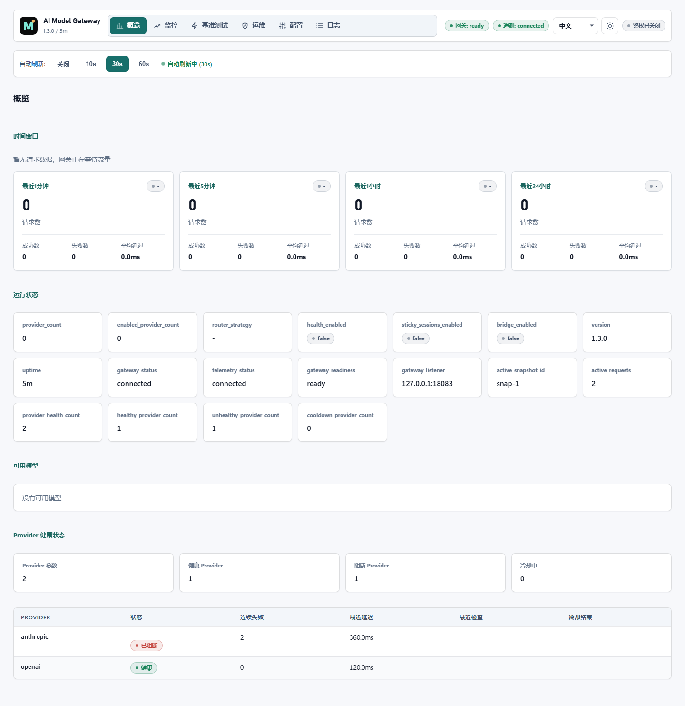
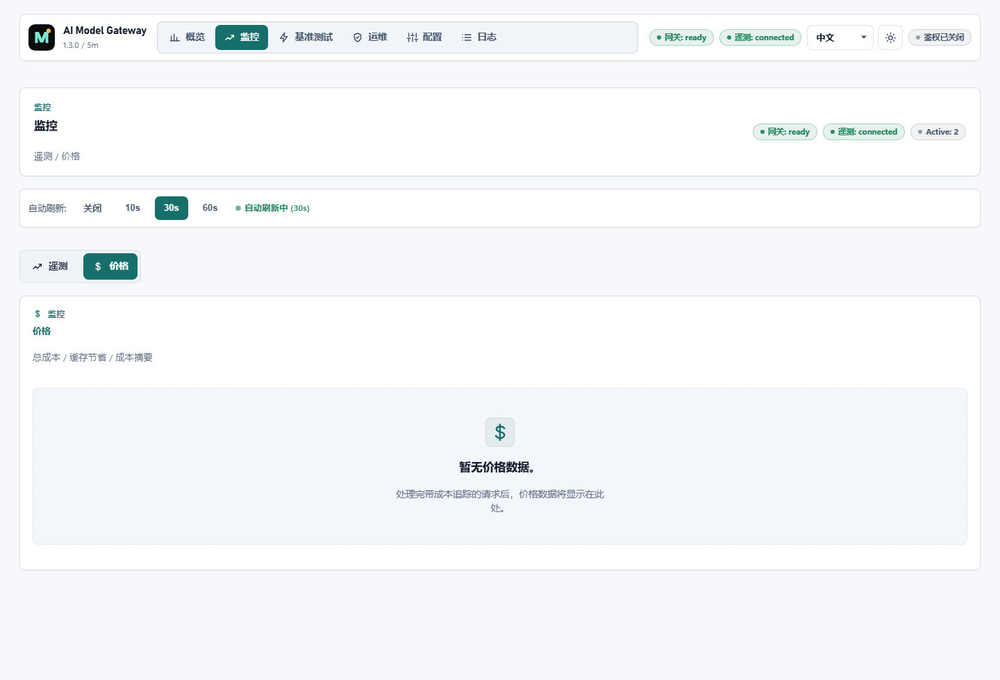
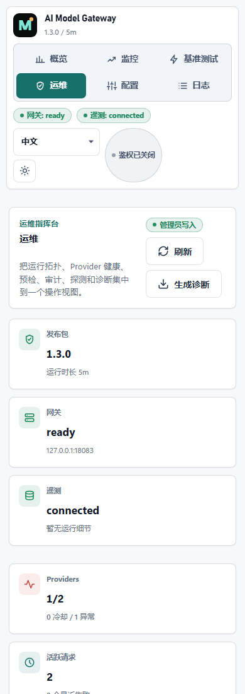
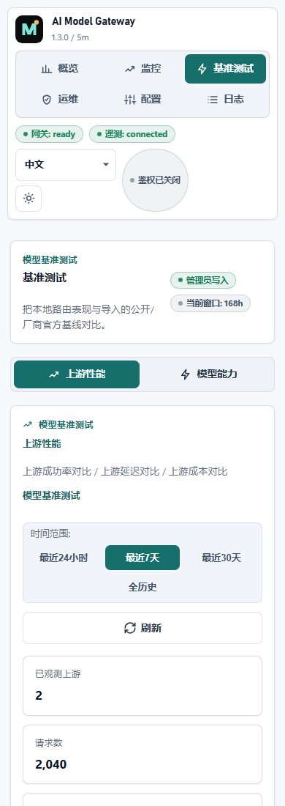

[](https://github.com/SSC-STUDIO/Ai-Model-Gateway/actions/workflows/ci.yml)
[](LICENSE)
[](VERSION)

# AI Model Gateway

AI Model Gateway is a self-hosted LLM gateway for teams that want provider routing, configuration publishing, telemetry, benchmarks, and day-2 operations in one compact Go runtime.

It is not trying to be another hosted model marketplace. The project is optimized for local control: one supervisor command, separate data/control/telemetry planes, OpenAI-compatible client entry points, provider health visibility, safe config rollout, and an admin UI that behaves like an operations console.

[Changelog](CHANGELOG.md) | [Contributing](CONTRIBUTING.md) | [Security](SECURITY.md) | [Docs](docs/) | [Roadmap](docs/roadmap.md) | [Differentiation](docs/differentiation.md) | [Promotion Kit](docs/promotion-kit.md) | [100-Star Campaign](docs/100-star-campaign.md)

If this project matches your self-hosted LLM infrastructure needs, star the repository so more operators can find it.

## Who Should Use It

AI Model Gateway is most useful when you are running LLM traffic for a team and need operational control rather than a hosted model marketplace:

- You want OpenAI, Anthropic, and Responses-compatible clients to enter through one local gateway.
- You need provider routing, fallback, rate limiting, and cache behavior that you can inspect and change.
- You want config changes to go through preview, diff, publish, audit, and rollback instead of editing a live proxy file.
- You need request logs, latency, cost, provider health, benchmarks, diagnostics, and replay in one admin surface.
- You want updates and rollback to use manifest-verified bundles instead of replacing binaries by hand.

## Try It Quickly

```bash
git clone https://github.com/SSC-STUDIO/Ai-Model-Gateway.git
cd Ai-Model-Gateway
go build -o ./dist/aigw ./cmd/aigw
go build -o ./dist/gatewayd ./cmd/gatewayd
go build -o ./dist/controld ./cmd/controld
go build -o ./dist/telemetryd ./cmd/telemetryd
cp configs/config.example.yaml configs/config.yaml
mkdir -p .gateway-runtime/telemetry .gateway-runtime/gateway .gateway-runtime/control
ADMIN_BOOTSTRAP_TOKEN=change-me-32-characters-minimum \
COOKIE_SIGNING_KEY=change-me-32-characters-minimum \
ADMIN_TOKEN=change-me-admin-token \
VIEWER_TOKEN=change-me-viewer-token \
./dist/aigw supervise -runtime-root .gateway-runtime -config-dir configs -bin-dir ./dist
```

Then open `http://localhost:18080/admin` and check `http://localhost:18080/-/health`.

## Choose A Setup Path

| Goal | Start here |
| --- | --- |
| Try the runtime locally | [Installation guide](docs/installation.md) |
| Match it to your team's workflow | [Use cases](docs/use-cases.md) |
| Evaluate whether self-hosting fits | [Self-hosted LLM gateway checklist](docs/self-hosted-llm-gateway-checklist.md) |
| Understand project direction | [Project roadmap](docs/roadmap.md) |
| Compare LLM gateway options | [LLM gateway comparison guide](docs/llm-gateway-comparison.md) |
| Understand config publish and rollback | [Config publish and rollback](docs/config-publish-rollback.md) |
| Operate provider fallback and health | [Provider fallback and health operations](docs/provider-fallback-health.md) |
| Run a provider fallback proof | [Provider fallback demo](examples/provider-fallback/) |
| Run it as an operations service | [Deployment guide](docs/deployment.md) |
| Control it from scripts or terminals | [CLI guide](docs/cli.md) |
| Point local AI tools at the gateway | [`aigw clients`](#point-local-ai-tools-at-the-gateway) |
| Debug startup, routing, or admin access | [Troubleshooting](docs/troubleshooting.md) |
| Ask what to improve next | [Maintainer discussion](https://github.com/SSC-STUDIO/Ai-Model-Gateway/discussions/25) |

## Why This Exists

The AI gateway space already has strong projects:

| Project type | Good at | AI Model Gateway difference |
| --- | --- | --- |
| [LiteLLM](https://github.com/BerriAI/litellm) / [Portkey](https://github.com/Portkey-AI/gateway)-style gateways | Broad provider coverage, unified APIs, spend controls, guardrails | Adds a native three-plane runtime, local config publishing, rollback, diagnostics, and an ops-first admin console |
| [Helicone](https://github.com/Helicone/helicone)-style observability | Request tracing, analytics, evaluations, experiments | Treats observability as one part of the gateway lifecycle instead of the whole product |
| [OpenRouter](https://openrouter.ai/)-style hosted routers | Fast access to many public models through a hosted broker | Keeps routing, keys, telemetry, and policy inside the user's own environment |
| Kong / [Envoy AI Gateway](https://github.com/envoyproxy/ai-gateway) stacks | Enterprise gateway ecosystem, plugins, Kubernetes-native traffic policy | Focuses on LLM-specific operations with fewer moving parts and a small self-hosted binary set |

See [docs/differentiation.md](docs/differentiation.md) for positioning notes and [docs/llm-gateway-comparison.md](docs/llm-gateway-comparison.md) for a practical selection guide.

## Core Capabilities

| Capability | What it does |
| --- | --- |
| Multi-protocol gateway | OpenAI Chat Completions, Anthropic Messages, and OpenAI Responses compatibility |
| Provider routing | Model matching, provider-level routing, fallback policy, and loop detection |
| Rate limiting | Token-bucket limits by API key, IP, and model |
| Request cache | In-memory LRU cache with configurable TTL and item count |
| SSRF protection | DNS pinning, private IP detection, and allowlist support |
| Config publishing | Authoring YAML -> compiled snapshot -> zero-interruption publish and rollback |
| Provider health operations | Health-aware weighted routing, probes, cooldown state, and incident checks |
| Telemetry plane | Async event ingestion, cost aggregation, timeseries projections, and query APIs |
| Audit log | Searchable control-plane operation history |
| Admin UI | Overview, Monitoring, Benchmark, Ops, Config, and Logs workspaces |
| Benchmarking | Multi-model comparison with exact, judge, JSON, tool, and stream scoring modes |
| Local CLI | Runtime status, preflight, diagnostics, provider probes, config diff, publish history, and rollback |

## Architecture

The runtime uses one operator entry point and three internal planes:

```text
                  external supervisor / systemd / k8s
                                |
                         +--------------+
                         | aigw         |
                         | supervise    |
                         +------+-------+
                                |
             +------------------+------------------+
             |                                     |
      +------+-------+                     +-------+------+
      | Data Plane   |                     | Control Plane|
      | gatewayd     |                     | controld     |
      | :18080       |                     | :18081       |
      +------+-------+                     +-------+------+
             |                                     |
             +------------------+------------------+
                                |
                         +------+-------+
                         | Telemetry    |
                         | telemetryd   |
                         | IPC only     |
                         +--------------+
```

- `aigw` is the local operations entry point for `supervise`, `doctor`, bundle verification, upgrades, and rollback workflows.
- `gatewayd` handles client inference traffic, compatible API routes, health checks, and telemetry event emission.
- `controld` serves the admin APIs and owns authoring config, compile/publish/rollback, audit, probing, and benchmark workflows.
- `telemetryd` ingests events over IPC and exposes projections through the control plane.

The old `gateway` / `gateway.exe` launcher has been removed. Production deployments should supervise `aigw supervise`.

## Admin UI

Open the admin console at `http://localhost:18080/admin` after the runtime starts.

| Workspace | Primary jobs |
| --- | --- |
| Overview | Gateway health, time windows, runtime state, provider health |
| Monitoring | Traffic, latency, cost, model usage, and pricing visibility |
| Benchmark | Model capability comparison, scoring, and promotion signals |
| Ops | Runtime status, provider probes, audit log, diagnostics, replay |
| Config | YAML/JSON/visual config editing, publish history, revision diff |
| Logs | Request search, error filtering, and CSV export |

### Screenshots

| Overview | Monitoring |
| --- | --- |
|  |  |

| Ops mobile | Benchmark mobile |
| --- | --- |
|  |  |

## Quick Start

### Build

```bash
go build -o ./dist/aigw        ./cmd/aigw
go build -o ./dist/gatewayd    ./cmd/gatewayd
go build -o ./dist/controld    ./cmd/controld
go build -o ./dist/telemetryd  ./cmd/telemetryd
go build -o ./dist/gateway-cli ./cmd/gateway-cli
```

Generate and verify a release manifest before packaging:

```bash
./dist/aigw bundle build -root . -out aigw-manifest.json
./dist/aigw bundle verify -root . -manifest aigw-manifest.json
```

### Configure

```powershell
Copy-Item .\configs\config.example.yaml .\configs\config.yaml
$env:ADMIN_BOOTSTRAP_TOKEN = "<32+ chars>"
$env:COOKIE_SIGNING_KEY = "<32+ chars>"
$env:ADMIN_TOKEN = "<admin token>"
$env:VIEWER_TOKEN = "<viewer token>"
```

`config.yaml` is the operator authoring config. The daemon bootstrap files are separate:

- `configs/gatewayd.json`
- `configs/controld.json`
- `configs/telemetryd.json`

### Run

```bash
mkdir -p .gateway-runtime/telemetry .gateway-runtime/gateway .gateway-runtime/control
./dist/aigw supervise -runtime-root .gateway-runtime -config-dir configs -bin-dir ./dist
```

### Verify

```bash
curl http://127.0.0.1:18080/-/health
curl http://127.0.0.1:18080/v1/models
curl http://127.0.0.1:18081/admin
```

Local development note: if another live service already owns `127.0.0.1:18080`, stop it or move the development runtime to different ports before starting the three-plane runtime.

## Point Local AI Tools At The Gateway

`aigw clients` can print environment snippets or update local tool config for Codex, Claude Code, and OpenClaw:

```bash
./dist/aigw clients print -config-dir configs
./dist/aigw clients apply -config-dir configs -api-key "<API key>"
./dist/aigw clients apply -dry-run
```

## CLI Examples

`gateway-cli` is the remote management CLI:

```bash
# Config
./dist/gateway-cli config show
./dist/gateway-cli config preview configs/config.yaml
./dist/gateway-cli config diff --file configs/config.yaml

# Runtime
./dist/gateway-cli runtime status
./dist/gateway-cli runtime preflight

# Audit and diagnostics
./dist/gateway-cli audit 50
./dist/gateway-cli diagnostics
./dist/gateway-cli secrets check

# Provider probes
./dist/gateway-cli probe model gpt-4 openai-demo
./dist/gateway-cli provider list
./dist/gateway-cli provider test openai

# Telemetry
./dist/gateway-cli telemetry events

# Publish management
./dist/gateway-cli publish history
./dist/gateway-cli publish rollback rev-001
```

Useful options:

- `-server url`: control-plane URL, default `http://127.0.0.1:18081`
- `-token token`: admin token, or use `ADMIN_TOKEN`
- `-format text|json|csv`: output format

## Tests

```bash
# Go tests
go test ./... -count=1

# Focused Go tests with coverage
go test ./internal/gateway/... -count=1 -cover

# Admin unit/component tests
npm --prefix web/admin test

# Admin production build
npm --prefix web/admin run build

# Admin Playwright audit
npm --prefix web/admin run test:e2e
```

## Repository Layout

| Path | Purpose |
| --- | --- |
| `cmd/aigw/` | Operations entry point |
| `cmd/gatewayd/` | Data-plane daemon |
| `cmd/controld/` | Control-plane daemon |
| `cmd/telemetryd/` | Telemetry daemon |
| `cmd/gateway-cli/` | Remote management CLI |
| `internal/control/` | Control-plane API, compiler, publisher |
| `internal/gateway/` | Snapshot runtime, API handlers, telemetry client |
| `internal/telemetry/` | Event log, projections, query layer |
| `internal/contracts/` | Cross-plane RPC and transport contracts |
| `internal/infra/` | Shared auth, config loader, pricing, and infrastructure |
| `internal/proxy/` | SSRF-safe proxy helpers |
| `web/admin/` | Admin SPA built with Preact and Vite |
| `configs/` | Example and bootstrap configuration |
| `docs/` | Architecture, installation, deployment, and operations docs |
| `scripts/` | Deployment and verification helpers |

## Operations Constraints

- Do not replace `gatewayd`, `controld`, or `telemetryd` independently during a normal upgrade. Ship one manifest-verified bundle.
- Run individual daemons only for advanced debugging. Production paths should use `aigw supervise`.
- Linux deployments can use `deploy/aigw.service` or `aigw service print`. Windows deployments should wrap `aigw.exe supervise` with NSSM or an equivalent service manager.

## Documentation

- [Differentiation](docs/differentiation.md)
- [Project Roadmap](docs/roadmap.md)
- [LLM Gateway Comparison Guide](docs/llm-gateway-comparison.md)
- [Self-Hosted LLM Gateway Checklist](docs/self-hosted-llm-gateway-checklist.md)
- [Config Publish and Rollback](docs/config-publish-rollback.md)
- [Architecture](docs/architecture.md)
- [Installation](docs/installation.md)
- [Deployment](docs/deployment.md)
- [CLI Guide](docs/cli.md)
- [Troubleshooting](docs/troubleshooting.md)
- [API Messages Endpoint](docs/api-messages-endpoint.md)
- [Chinese Model Integration](docs/chinese-models-integration.md)
- [Changelog](CHANGELOG.md)
- [Contributing](CONTRIBUTING.md)
- [Code of Conduct](CODE_OF_CONDUCT.md)
- [Security Policy](SECURITY.md)

## License

MIT. See [LICENSE](LICENSE).
