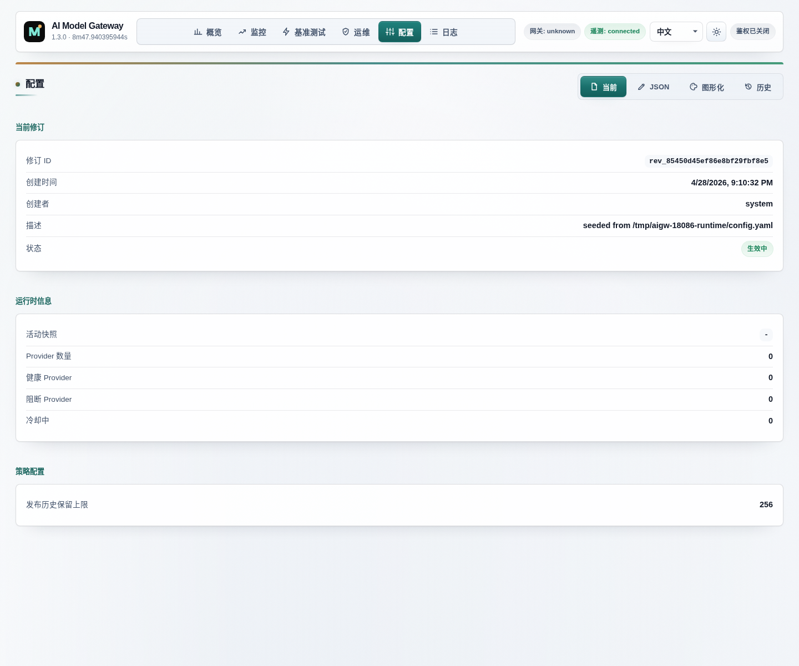

# AI Model Gateway

[](https://github.com/SSC-STUDIO/ai-model-gateway/actions/workflows/ci.yml)
[](LICENSE)
[](VERSION)
[](#development)


本项目是一个本地运行的 OpenAI-compatible 网关，目标是把多家上游服务、热加载配置、自动切换、可视化运维、成本估算和缓存命中分析收敛到一个统一入口。

它适合这些场景：

- 用统一的 `base_url` / `api_key` 接入多家 OpenAI 兼容中转站
- 按模型白名单把请求路由到不同上游
- 在上游不稳定时自动重试、切换、冷却降级
- 观察请求量、延迟、失败轨迹、缓存命中和估算成本
- 运行时直接在管理页维护 bridge / retry / upstream / config history
- 兼容 Claude 等非原生 OpenAI 模型，通过网关做协议适配

## Highlights

- **CLI 管理**: 支持命令行启动、验证配置、健康检查、Windows 服务管理
- OpenAI 兼容接口：`chat/completions`、`responses`、`embeddings`、`files`、`audio`、`images`、`models` 等
- 多上游容灾：按健康状态、权重和失败窗口自动切换
- 热加载：修改 YAML 后自动生效
- 会话粘性：`responses` 会优先回到同一上游，提高 prompt cache 命中率
- 定价系统：本地缓存 OpenAI 官方价格页，桥接请求也能按请求模型计价
- 持久化 telemetry：请求、错误、token、缓存命中、成本都落 SQLite
- 管理页：图表、表格、成本、缓存趋势、配置编辑、配置历史、diff 预览
- 协议兼容：当上游只支持 `chat/completions` 或 `messages` 时，自动回退并封装回 OpenAI 风格响应

## Screenshot

### Admin overview


### Admin settings



## Repo metadata

- License: [MIT](LICENSE)
- Change log: [CHANGELOG.md](CHANGELOG.md)
- CLI Documentation: [docs/cli.md](docs/cli.md)
- Installation Guide: [docs/installation.md](docs/installation.md)
- CI: [GitHub Actions workflow](.github/workflows/ci.yml)
- Release workflow: [GitHub Release workflow](.github/workflows/release.yml)
- Contribution guide: [CONTRIBUTING.md](CONTRIBUTING.md)
- Security policy: [SECURITY.md](SECURITY.md)
- Support guide: [SUPPORT.md](SUPPORT.md)

## Architecture

### Request flow

1. 客户端把请求发到本地网关。
2. 网关读取请求中的 `model`，应用 bridge 规则和模型白名单。
3. 路由层根据健康状态、权重、失败计数和 sticky session 选择上游。
4. 代理层转发请求，必要时做 SSE/Responses/Claude 兼容转换。
5. telemetry 记录请求轨迹、usage、缓存命中、错误和估算成本。
6. 管理页从 `/-/admin/data` 与 `/-/admin/timeseries` 读取聚合数据展示。

### Project layout

- `cmd/gateway`
  Gateway 入口。
- `internal/cli`
  命令行接口实现。
- `internal/config`
  YAML 配置结构、默认值、校验、加载器。
- `internal/router`
  上游选择、失败冷却、sticky session。
- `internal/proxy`
  OpenAI-compatible 转发、重试、Claude/Responses 兼容。
- `internal/server`
  HTTP 路由、管理页、管理接口。
- `internal/telemetry`
  SQLite telemetry、时间序列、pricing 聚合。
- `internal/state`
  运行时配置原子存储。
- `internal/service`
  Windows 服务管理。
- `configs`
  配置示例。
- `scripts`
  常用启动、服务安装、压测脚本。
- `docs`
  图标与 README 截图素材、CLI 文档、安装指南。

## Supported endpoints

当前已覆盖以下接口：

- `POST /v1/chat/completions`
- `POST /v1/completions`
- `POST /v1/embeddings`
- `POST /v1/responses`
- `POST /v1/responses/compact`
- `GET /v1/responses/{response_id}`
- `DELETE /v1/responses/{response_id}`
- `POST /v1/moderations`
- `POST /v1/images/generations`
- `POST /v1/images/edits`
- `POST /v1/images/variations`
- `POST /v1/audio/speech`
- `POST /v1/audio/transcriptions`
- `POST /v1/audio/translations`
- `GET /v1/files`
- `POST /v1/files`
- `GET /v1/files/{file_id}`
- `DELETE /v1/files/{file_id}`
- `GET /v1/files/{file_id}/content`
- `GET /v1/models`
- `GET /-/health`
- `GET /admin`
- `GET /admin/settings`
- `GET /-/admin/data`
- `GET /-/admin/timeseries`
- `GET|PUT /-/admin/config`
- `GET /-/admin/config/export`
- `GET /-/admin/config/history`
- `GET /-/admin/config/history/{version_id}/diff`
- `POST /-/admin/config/rollback`

## Quick start

### Requirements

- Go 1.26+ (for building from source)
- Windows PowerShell（脚本示例默认按 PowerShell 写）

### Installation

#### Option 1: Download Binary (Recommended)

从 [GitHub Releases](https://github.com/SSC-STUDIO/ai-model-gateway/releases) 下载对应平台的预编译二进制文件。

#### Option 2: Build from Source

```powershell
go build -o gateway.exe ./cmd/gateway
```

#### Option 3: Install as Windows Service

```powershell
# Install and start as Windows service
gateway.exe install
gateway.exe service-start
```

### 1. Prepare config

```powershell
Copy-Item .\configs\config.example.yaml .\configs\config.yaml
```

按需填写：

- `upstreams[].base_url`
- `upstreams[].api_key`
- `upstreams[].models`
- `admin.auth_token`
- `telemetry.sqlite_path`
- `pricing.cache_path`

如果你要接 `Kimi Code` 上游，推荐使用：

- `base_url: https://api.kimi.com/coding`
- `anthropic_base_url: https://api.kimi.com/coding`
- `api_key: sk-your-kimi-code-key`
- `models: [kimi-for-coding]`

### 2. Run the gateway

#### Using CLI (Recommended)

```powershell
# Start with default config
gateway.exe start

# Start with custom config
gateway.exe -config .\configs\config.yaml start

# Validate config before starting
gateway.exe validate
```

#### Legacy Mode (Backward Compatible)

```powershell
go run .\cmd\gateway -config .\configs\config.yaml
```

默认监听地址由配置里的 `listen` 决定，常见本地地址例如：

```text
http://127.0.0.1:18080
```

### 3. Health Check

```powershell
# Check gateway health
gateway.exe health

# Or use curl
curl.exe http://127.0.0.1:18080/-/health
```

### 4. Open admin pages

浏览器访问管理页时，先建立同源的 `aigw_admin_token` cookie 会话，再访问页面；脚本或 CLI 直接调用 admin API 时，推荐使用 Bearer token。

概览页：

```text
http://127.0.0.1:18080/admin
```

设置页：

```text
http://127.0.0.1:18080/admin/settings
```

### Admin auth modes and browser boundary

- 浏览器：admin 页面会携带 `credentials: 'same-origin'`，cookie-auth 的写请求仅允许同源 `Origin`，缺失时仅接受同源 `Referer` 后备。
- 自动化：脚本、CLI、curl 调用 `/-/admin/config`、`/-/admin/config/rollback`、`/-/admin/upstreams/test` 时，推荐使用 `Authorization: Bearer <token>`，不会被 `Origin` / `Referer` 限制误伤。
- 导出与排障：`GET /-/admin/config/export`、配置视图、config history diff、upstream probe 响应会自动脱敏 `api_key`、`auth_token` 和常见敏感 header 值；导出的 YAML 适合做备份模板，不适合直接当作可运行配置回灌。
- 暴露面：不要把 admin URL、Bearer token 或已登录的 admin cookie 会话暴露给不受信任来源；管理页应只在受信任浏览器上下文中打开。

## CLI Commands

网关提供完整的命令行接口：

| 命令 | 说明 |
|------|------|
| `gateway start` | 启动网关服务 |
| `gateway validate` | 验证配置文件 |
| `gateway health` | 检查服务健康状态 |
| `gateway install` | 安装为 Windows 服务 |
| `gateway uninstall` | 卸载 Windows 服务 |
| `gateway service-start` | 启动 Windows 服务 |
| `gateway service-stop` | 停止 Windows 服务 |
| `gateway service-status` | 查看服务状态 |
| `gateway version` | 显示版本信息 |

更多 CLI 用法详见 [docs/cli.md](docs/cli.md)。

## Configuration guide

### Upstreams

每个上游都可以独立配置：

- `name`
- `base_url`
- `api_key`
- `provider_class`
- `models`
- `weight`
- `timeout_ms`
- `same_upstream_retries`
- `enabled`
- `headers`

这样可以把不同模型或不同供应商拆成多个路由条目。

Kimi 相关有两种常见接法：

- `Kimi Code`
  使用 `base_url: https://api.kimi.com/coding`，并同时设置 `anthropic_base_url: https://api.kimi.com/coding`；模型通常是 `kimi-for-coding`
- `Moonshot Open Platform`
  使用 `api.moonshot.cn` 或 `api.moonshot.ai` 的 Open Platform key，并按该平台返回的模型 ID 配置 `models`

`provider_class` 目前支持两类：

- `free`
- `quota_limited`

路由优先级是先选 `free`，只有当免费上游不可用、拥塞或不支持目标模型时，才回退到 `quota_limited`。

如果 `quota_limited` 上游返回 `insufficient_quota`、`quota exceeded`、`exceeded your current quota` 一类额度耗尽信息，当前进程会把这个上游临时标记为不可再选，后续请求不再继续打它。

### Routing and retry

`router` 控制：

- `strategy`
- `max_retries`
- `retry_backoff_ms`
- `retry_backoff_max_ms`
- `failure_threshold`
- `cooldown_sec`
- `failure_passthrough_after_sec`
- `sticky_sessions.enabled`
- `sticky_sessions.ttl_sec`

### Health checks

`health` 控制主动探活：

- `enabled`
- `interval_sec`
- `timeout_ms`
- `path`

### Model bridge

bridge 可以把请求模型重写到另一个模型，例如把部分流量临时桥接到更稳定的模型。

```yaml
bridge:
  enabled: true
  exclude_user_agents:
    - "*Codex Desktop*"
  rules:
    - from: gpt-5.2
      to: gpt-5.4
```

说明：

- `from` 支持通配
- `exclude_user_agents` 支持通配
- 命中 bridge 后，定价仍优先按原始 `requested_model` 归因
- 对 Codex / IDE 内部请求，建议按 UA 做排除，避免误改写系统请求

### Kimi upstream example

```yaml
upstreams:
  - name: kimi-official
    base_url: https://api.kimi.com/coding
    anthropic_base_url: https://api.kimi.com/coding
    api_key: sk-your-kimi-code-key
    provider_class: quota_limited
    models:
      - kimi-for-coding
    weight: 1
    timeout_ms: 180000
    same_upstream_retries: 1
    enabled: true
    headers: {}
```

验证步骤：

- `GET /v1/models` 中应出现 `kimi-for-coding`
- `POST /v1/responses` 并指定 `model: "kimi-for-coding"` 应返回成功响应
- 如果客户端直接调用 `POST /v1/chat/completions` 且指定 `model: "kimi-for-coding"`，也应返回成功响应

说明：

- `Kimi Code` 实测可用的是 Anthropic `messages` 接口；网关会把外部的 OpenAI `responses` / `chat/completions` 请求自动兼容到 `messages`
- 因此推荐显式配置 `anthropic_base_url`，避免把这种能力隐含在特定上游实现里

如果你希望 `kimi-cli` 也通过本地网关访问这个上游，可以把它配置为 `openai_responses` provider，并将 `base_url` 指向 `http://127.0.0.1:18080/v1`。

### Retry and intercept

`proxy.retry` 和 `proxy.intercepts` 支持把原来写死在代码里的失败判定变成配置项。

常见用途：

- 对 `408` / `429` / `5xx` 自动重试
- 对上游错误正文中的关键字触发 retry
- 对某些路径或状态码提前判定为 fail / retry
- 切到 `infinite_on_error: true` 后，对 transport / status / intercept 命中的任何错误持续重试，直到调用方主动取消请求

## Admin UI

### Overview page

概览页聚焦读数和决策，不直接展示配置编辑器，适合日常巡检：

- Runtime Posture：当前恢复模式、失败出口、探活状态、启用 provider 数量
- Success rate / total cost / 1m RPM / 1m TPM
- Live Performance
- Throughput / Latency / Token / Success-Failure 图表
- Model Economics
- Cost Snapshot
- Upstream Health / Usage
- Cache Trends / Cache Hit Ranking
- Recent Errors / Recent Requests

### Settings page

设置页单独拆到 `/admin/settings`，避免把大块配置表单直接塞进首页。

设置页支持：

- health check 编辑
- model bridge 编辑
- retry policy 编辑
- bounded / infinite recovery 预设切换，以及 infinite mode 对 retry ceiling / failure exit 的影响提示
- response intercept 编辑
- upstream provider 编辑
- provider class 过滤：`all / free / quota_limited`
- 配置导出
- 历史版本浏览
- 差异预览与回滚

## Pricing and cache accounting

本项目的计价与缓存统计做了几件事：

- OpenAI 官方价格抓取结果会缓存到本地 JSON
- 抓取失败时，回退到缓存和内置价格种子
- 桥接流量优先按 `requested_model` 定价，而不是只看实际转发模型
- telemetry 会分别记录 `prompt_tokens`、`cached_prompt_tokens`、`completion_tokens`
- 管理页会展示模型级、上游级、窗口级的 cache hit

这能更准确地回答两个问题：

- 现在的钱到底花在哪个模型上
- 成本高是因为 token 真的多，还是因为缓存命中被路由打散了

## Compatibility

一些上游只支持 `chat/completions` 或 `messages`，不支持 OpenAI `Responses API`。典型例子包括部分 Claude 上游，以及当前的 `Kimi Code` upstream。

网关内置了一层兼容逻辑：

- 客户端仍然可以打 `/v1/responses`
- 当上游返回 `not implemented` / `unsupported` / `not found` 等不兼容信号时
- 网关会按上游能力自动回退到 `chat/completions` 或 `messages`
- 再把结果包装回 OpenAI 风格的 `response` 对象、`chat.completion` 或简化 SSE 事件

这让使用 OpenAI 风格 SDK 的客户端也能继续接 Claude 或 Kimi 这类非原生 OpenAI 上游。

## Persistence

- telemetry 使用 SQLite 持久化
- pricing cache 使用本地 JSON
- 配置保存时会自动保留 `.bak` 和历史版本目录

因此：

- 网关重启后管理页统计不会立刻归零
- 配置误改后可以从历史版本回滚
- 定价页不会因为官方页面短时不可达而完全失效

## Scripts

常用脚本：

```powershell
.\scripts\start-gateway.ps1
.\scripts\rebuild-and-restart.ps1
.\scripts\install-service.ps1
.\scripts\uninstall-service.ps1
.\scripts\invoke-responses-burst.ps1 -Concurrency 20 -RequestsPerWorker 1 -LaunchIntervalMs 200
```

如果你要把它装成 Windows 服务，推荐直接使用 CLI 命令：

```powershell
# 安装为 Windows 服务（需要管理员权限）
gateway.exe install

# 管理服务
gateway.exe service-start
gateway.exe service-stop
gateway.exe service-status

# 卸载服务
gateway.exe uninstall
```

## Development

### Format and test

```powershell
gofmt -w .\cmd\gateway\main.go .\internal\**\*.go
go test ./...
```

### Test Coverage

项目当前测试覆盖率：

- `internal/cli`: 80%+ ✅
- `internal/config`: 80%+ ✅
- `internal/router`: 80%+ ✅

### Useful checks

```powershell
# CLI health check
gateway.exe health

# Or curl
curl.exe http://127.0.0.1:18080/-/health
curl.exe http://127.0.0.1:18080/v1/models
```

## Migration from PowerShell Scripts

如果你之前使用 PowerShell 脚本，可以迁移到新的 CLI 命令：

| 旧脚本 | 新 CLI 命令 |
|--------|-------------|
| `install-service.ps1` | `gateway install` |
| `uninstall-service.ps1` | `gateway uninstall` |
| `start-gateway.ps1` | `gateway start` |
| `quick-verify.ps1` | `gateway validate` |
| `restart-gateway.ps1` | `gateway service-stop && gateway service-start` |

## Public repo notes

公开发布时，建议不要提交这些内容：

- 实际生产 `config.yaml`
- API keys
- SQLite telemetry 数据文件
- pricing cache 数据文件
- 本机日志
- AI 过程文件 / 临时文件

本仓库已经通过 `.gitignore` 排除了这些本机状态文件。

## License

[MIT](LICENSE)
